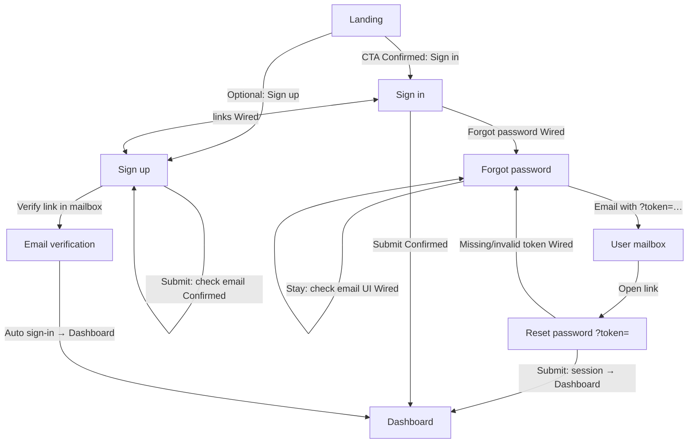
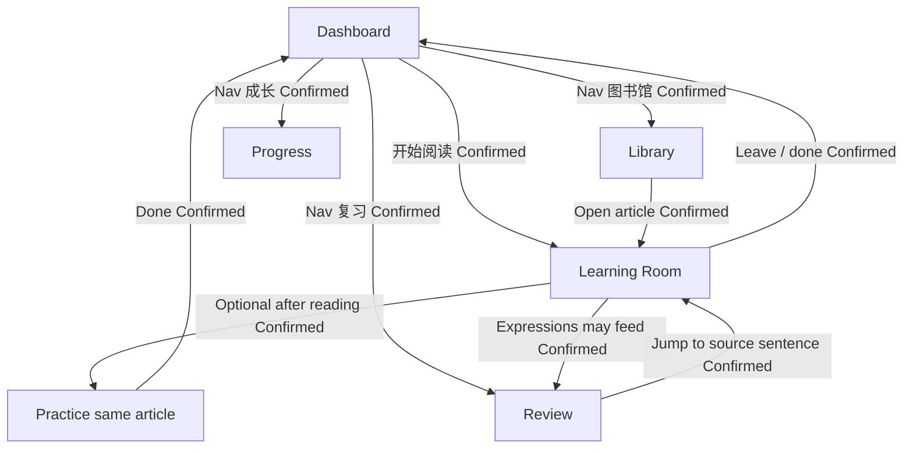

# Prototype & product flows

**SSOT for “which screen leads where.”**  
HTML under [`../../prd/`](../../prd/) is visual reference; **this doc wins on navigation** when they disagree.

Related: [`mvp-scope.md`](./mvp-scope.md) · [`product-vision.md`](./product-vision.md) · [`design-guardrails.md`](./design-guardrails.md)

**How to use**

- Implement / wire prototypes against the tables below.
- Items marked **Confirmed** are product decisions (locked 2026-08-05).
- Items marked **Wired in HTML** exist as real `href` / script jumps in `prd/` today.
- Items marked **Not wired** must still follow Confirmed edges when linking HTML or apps/web.

---

## 1. Prototype inventory

| Surface         | File                                 | Audience         | Role                           |
| --------------- | ------------------------------------ | ---------------- | ------------------------------ |
| Landing         | `elynd-landing-v1.html`              | Logged-out       | Story / why / CTA into auth    |
| Sign in         | `elynd-auth-sign-in-v1.html`         | Logged-out       | Email + password               |
| Sign up         | `elynd-auth-sign-up-v1.html`         | Logged-out       | Create account                 |
| Forgot password | `elynd-auth-forgot-password-v1.html` | Logged-out       | Request reset email            |
| Reset password  | `elynd-auth-reset-password-v1.html`  | Logged-out+token | Set new password; then session |
| Dashboard       | `dashboard.html`                     | Logged-in        | Home / resume / nav hub        |
| Library         | `elynd-library-v1.html`              | Logged-in        | Discover / pick content        |
| Learning Room   | `learning-room-v1.html`              | Logged-in        | Read / listen / lookup         |
| Practice        | `elynd-practice-v1.html`             | Logged-in        | Short checks on **same** text  |
| Review          | `elynd-review-v2.html`               | Logged-in        | Re-meet expressions            |
| Progress        | `elynd-progress-v1.html`             | Logged-in        | Time-with-language (no shame)  |

---

## 2. Auth & marketing flow

### 2.1 Diagram



### 2.2 Edges

| From            | Entry / control     | To                      | Status                                                         |
| --------------- | ------------------- | ----------------------- | -------------------------------------------------------------- |
| Landing         | Primary CTA         | Sign in                 | **Confirmed** · Wired                                          |
| Landing         | Secondary           | In-page belief          | Wired (`#belief`)                                              |
| Landing         | Logo                | Landing top             | Wired / self                                                   |
| Sign in         | Register link       | Sign up                 | Wired                                                          |
| Sign in         | Forgot password     | Forgot password         | Wired                                                          |
| Sign in         | Submit success      | Dashboard               | **Confirmed** (Not wired in HTML prototype)                    |
| Sign up         | Sign in link        | Sign in                 | Wired                                                          |
| Sign up         | Submit success      | Same page “check email” | **Confirmed** (hard email verification; no session yet)        |
| Sign up         | Verify email link   | Dashboard               | **Confirmed** (auto sign-in after verification)                |
| Sign in         | Unverified account  | Stay + resend mail      | **Confirmed**                                                  |
| Forgot password | Submit email        | Same page “sent”        | Wired (panel)                                                  |
| Forgot password | Demo / real mail    | Reset `?token=`         | Wired (demo link)                                              |
| Reset password  | Submit new password | Dashboard               | Wired in prototype (auto sign-in, **no** success interstitial) |
| Reset password  | No / bad token      | Forgot password         | Wired                                                          |
| Any auth page   | Elynd logo          | Landing                 | Wired                                                          |

**Reset product rule (Confirmed):** set password → auto sign-in → Dashboard. No success page.

**Sign-up verification rule (Confirmed):** create account → same-page check email → verify link → auto sign-in → Dashboard. No session until verified.

---

## 3. Logged-in learning loop

Aligned with vision “one material, full loop” and MVP sitting of ~5–20 minutes.

### 3.1 Diagram



### 3.2 Edges

| From          | Entry / control            | To                        | Status                                         |
| ------------- | -------------------------- | ------------------------- | ---------------------------------------------- |
| Dashboard     | “开始阅读” / continue card | Learning Room             | **Confirmed** · Wired (current/resume article) |
| Dashboard     | Nav 今日                   | Dashboard                 | Self / home · Wired                            |
| Dashboard     | Nav 图书馆                 | Library                   | **Confirmed** · Wired                          |
| Dashboard     | Nav 复习                   | Review                    | **Confirmed** · Wired                          |
| Dashboard     | Nav 成长                   | Progress                  | **Confirmed** · Wired                          |
| Library       | Pick article               | Learning Room             | **Confirmed** (+ `articleId`)                  |
| Learning Room | Lookup / TTS               | Stay in Room              | In-place                                       |
| Learning Room | Optional “练一下”          | Practice                  | **Confirmed** (same `articleId`; optional)     |
| Practice      | Finish                     | Dashboard                 | **Confirmed**                                  |
| Review        | Open item                  | Learning Room at sentence | **Confirmed**                                  |
| Progress      | Soft CTA                   | Library or Dashboard      | Soft preference; do not force                  |

**Shell (Confirmed):** Nav = 今日 / 图书馆 / 复习 / 成长 only. No top-level Practice or Learning Room. Practice is post-reading; Room is reached via content.

**Dashboard “开始阅读” (Confirmed):** always opens Learning Room for the **current** article. Library is for choosing something else.

**Practice entry (Confirmed):** primarily from Room after reading. Dashboard may show “继续练习” only if a practice is already in progress.

---

## 4. Happy path (MVP session)

```text
Sign in → Dashboard
  → open / resume text (Today card → Room, or Library → Room)
  → Learning Room (read + optional listen + on-demand help)
  → optional Practice (1–3 checks on that text)
  → Dashboard
  → Review / Progress later from shell
```

Auth alone without this loop is **infra**, not learning MVP.

---

## 5. Cross-cutting rules

| Rule                                                                                | Source                 |
| ----------------------------------------------------------------------------------- | ---------------------- |
| App entry after auth is Dashboard                                                   | mvp-scope P0           |
| AI / lookup secondary inside Room; not chat-home                                    | vision + guardrails    |
| Practice optional and after comprehension of the same text                          | philosophy + mvp-scope |
| Progress must not shame                                                             | guardrails             |
| Flows doc > ad-hoc HTML links                                                       | this SSOT              |
| Older product-space HTML may lag Landing/Auth visual system; still follow this flow | engineering reality    |

---

## 6. Confirmed decisions (2026-08-05)

| #   | Decision                                                                      |
| --- | ----------------------------------------------------------------------------- |
| 1   | Landing primary CTA → **Sign in**                                             |
| 2   | Sign-up → check email → verify link → **Dashboard** (hard email verification) |
| 3   | Dashboard “开始阅读” → **Learning Room** (current article)                    |
| 4   | Practice → **mainly from Room** after reading                                 |
| 5   | After Practice → **Dashboard**                                                |
| 6   | Dashboard nav → **今日 / 图书馆 / 复习 / 成长** only (no Practice / Room)     |

---

## 7. Known prototype drift (product audit 2026-08-05)

Copy / CTA pass applied on the same day for high and medium items. Visual unification with Landing/Auth remains later work.

| Severity | Where           | Original issue                        | Status after pass                                        |
| -------- | --------------- | ------------------------------------- | -------------------------------------------------------- |
| High     | Practice        | AI chat CTA, daily goals, finish wall | Softened: text-bound checks, skip OK, back to Today      |
| High     | Learning Room   | Guide-as-hero, “完成学习”             | Assist = “卡住时再看”; soft exit; optional practice link |
| Medium   | Dashboard       | Flame streak                          | Soft “有读过”; nav + Start reading wired                 |
| Medium   | Review          | AI dialogue review, streak            | Re-meet / open source; soft days copy                    |
| Medium   | Library         | “AI 推荐” headline                    | Interest + level framing                                 |
| Medium   | Cross-prototype | Visual split vs Landing/Auth          | Still open (visual only)                                 |
| Low      | Landing ↔ auth  | CTA Not wired                         | Wired to Sign in                                         |

**North-star check:** MVP success is weekly minutes of engaged reading—not completing daily goals, not starting AI chat, not protecting a streak.

---

## 8. Change log

| Date       | Change                                                                |
| ---------- | --------------------------------------------------------------------- |
| 2026-08-05 | Initial SSOT from docs + `prd` auth wiring                            |
| 2026-08-05 | Locked §6 decisions; marked Confirmed edges; added §7 prototype drift |
| 2026-08-05 | Prototype copy pass for §7; Dashboard/Room/Landing links              |
