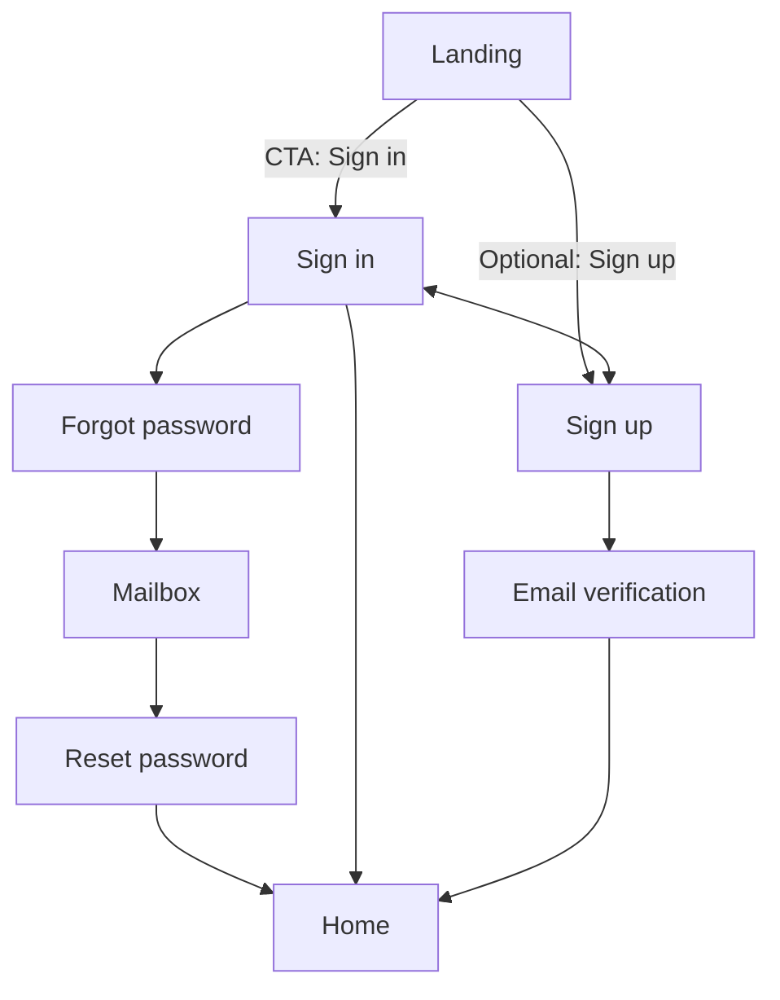
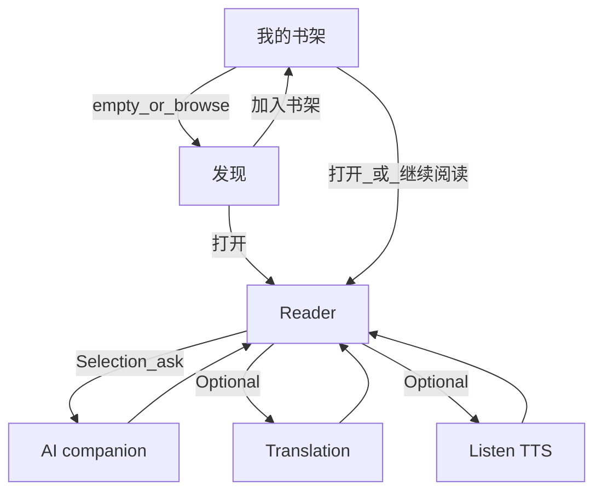
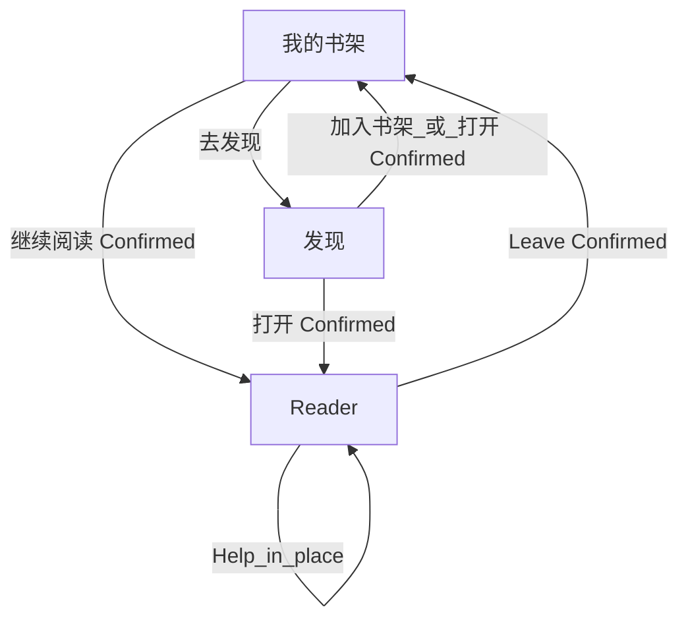

# Product flows

**SSOT for “which screen leads where.”** Wire the shipped app against the tables below. Visual tokens: [`DESIGN.md`](../../DESIGN.md).

Related: [`mvp-scope.md`](./mvp-scope.md) · [`mvp-1-modules.md`](./mvp-1-modules.md) · [`product-vision.md`](./product-vision.md) · [`feature-audit.md`](./feature-audit.md)

**How to use**

- Wire the app against the tables below.
- **Module inventory SSOT for MVP 1:** [`mvp-1-modules.md`](./mvp-1-modules.md).
- **Confirmed** = product decisions (auth 2026-08-05; reading loop 2026-08-20; learner IA 2026-08-20).
- Do not revive Practice or Review screens. Do not add upload to MVP 1 flows (Phase 1b).

---

## 1. Surfaces (MVP 1 / Phase 1a)

| Surface (label) | Audience   | Role now                                        |
| --------------- | ---------- | ----------------------------------------------- |
| Landing         | Logged-out | Story / CTA into auth                           |
| Sign in / up    | Logged-out | Auth                                            |
| **我的书架**    | Logged-in  | Default home: continue reading + my shelf       |
| **发现**        | Logged-in  | Official catalog; add to shelf; may open reader |
| **阅读历史**    | Logged-in  | Reading-history overview                        |
| Reader          | Logged-in  | Core surface: read + assist / translate / TTS   |

Practice and Review surfaces are **removed**. User upload / import is **out of MVP 1** (Phase 1b).

---

## 2. Auth & marketing flow

Unchanged in structure. Landing primary CTA → Sign in. Sign-up → verify email → auto sign-in → **home**. Reset password → auto sign-in → **home**.



| From                   | To                          | Status                                  |
| ---------------------- | --------------------------- | --------------------------------------- |
| Landing primary CTA    | Sign in                     | **Confirmed**                           |
| Sign in success        | Home (reading)              | **Confirmed** (was Dashboard)           |
| Sign-up                | Check email → verify → Home | **Confirmed** (hard email verification) |
| Reset password success | Home                        | **Confirmed**                           |

---

## 3. First-time user journey (MVP 1 / Phase 1a)

```text
Sign in
  → 我的书架
  → 发现 → 加入书架 (or open)
  → Reader opens
  → Read
  → Language barrier → contextual help / translation / TTS
  → Keep reading
```



**Confirmed (2026-08-20):** first success is **read a real page with help available**, not finish a practice set. Daily first action is **resume the unfinished text** on **我的书架**.

**Confirmed (2026-08-20, IA):** MVP 1 supply is **发现 → 书架**. User upload is Phase **1b** ([`mvp-1-modules.md`](./mvp-1-modules.md)).

---

## 4. Daily reading loop (MVP 1)

```text
Open Gloaming
  → 我的书架 → Resume last document
  → Read
  → AI help when stuck
  → Keep reading
  → Leave (closing the book completes the session)
```



| From     | Entry                             | To                | Status                |
| -------- | --------------------------------- | ----------------- | --------------------- |
| 我的书架 | Continue / last position          | Reader            | **Confirmed**         |
| 我的书架 | Browse                            | 发现              | **Confirmed**         |
| 发现     | Add to shelf                      | 我的书架          | **Confirmed**         |
| 发现     | Open item                         | Reader            | **Confirmed**         |
| 我的书架 | Open shelf item                   | Reader            | **Confirmed**         |
| Reader   | Lookup / translate / TTS / assist | Stay in reader    | **Confirmed**         |
| Reader   | Done for now                      | 我的书架 or close | **Confirmed**         |
| Reader   | Practice CTA                      | —                 | **Retired** (removed) |
| Any      | 复习                              | —                 | **Retired** (removed) |
| Any      | Upload (MVP 1)                    | —                 | **Deferred** (1b)     |

**Shell (Confirmed 2026-08-20):** default nav is **我的书架 + 发现 + 阅读历史**. No Practice or Review. Reader is reached via content.

**我的书架 primary CTA (Confirmed):** **继续阅读** opens the current document in the reader.

---

## 5. Happy path (MVP 1 session)

```text
Sign in → 我的书架
  → resume or 发现 → add / open
  → Reader (read + optional listen + on-demand help)
  → leave
```

Auth without this loop is **infra**, not product MVP 1.

---

## 6. Cross-cutting rules

| Rule                                                   | Source                                   |
| ------------------------------------------------------ | ---------------------------------------- |
| After auth, land on 我的书架                           | MVP 1 modules                            |
| AI / lookup secondary inside the reader; not chat-home | vision + principles                      |
| No required practice or review                         | V1 non-goals                             |
| 阅读历史 is reading history, not streak theater        | guardrails + feature-audit               |
| No upload in MVP 1 chrome                              | mvp-1-modules Phase 1a                   |
| Module inventory SSOT                                  | [`mvp-1-modules.md`](./mvp-1-modules.md) |
| This doc is navigation journey SSOT                    | this file                                |

---

## 7. Confirmed decisions

| #   | Decision                                              | When                                |
| --- | ----------------------------------------------------- | ----------------------------------- |
| 1   | Landing primary CTA → Sign in                         | 2026-08-05                          |
| 2   | Sign-up → verify → reading home                       | 2026-08-05                          |
| 3   | 我的书架 continue → Reader (current document)         | 2026-08-20 (replaces “今日 → 练习”) |
| 4   | Default nav → 我的书架 + 发现 + 阅读历史              | 2026-08-20                          |
| 5   | Practice / Review not in the loop                     | 2026-08-20                          |
| 6   | MVP 1 = Phase 1a catalog→shelf; import = Phase 1b     | 2026-08-20                          |
| 7   | Shelf source labels `官方` / `用户` (`用户` = 1b)     | 2026-08-20                          |
| 8   | No independent Search page; no global upload in MVP 1 | 2026-08-20                          |

Retired (2026-08-05, no longer Confirmed): Practice mainly from Room; nav 今日 / 图书馆 / 复习 / 成长; after Practice → Dashboard.  
Superseded (2026-08-20): “Import + parse are required before calling V1 done” as a single gate—now split 1a / 1b.

---

## 8. Known drift

| Where            | Issue                                           | Action                                         |
| ---------------- | ----------------------------------------------- | ---------------------------------------------- |
| App nav          | Still labeled 今日 / 图书馆 / 成长              | Rename to 我的书架 / 发现 / 阅读历史           |
| Dashboard home   | Catalog-shaped “今日”, not shelf + continue     | Become 我的书架                                |
| Library          | Published catalog only; no “add to my shelf”    | Become 发现 + shelf membership                 |
| Content atom     | Short curated `article.body`                    | Document / chapters later (feature-audit §4.1) |
| Progress metrics | “Learning days” wording; no year/30d volume yet | Evolve under 阅读历史 when ready               |

**North star:** weekly minutes of engaged reading of authentic English—not practice completion, not review queues, not chat turns.

---

## 9. Change log

| Date       | Change                                                                                               |
| ---------- | ---------------------------------------------------------------------------------------------------- |
| 2026-08-20 | Learner IA: 我的书架 / 发现 / 阅读历史; MVP 1 = catalog→shelf; import deferred to 1b.                |
| 2026-08-20 | Removed `prd/` HTML prototypes; Practice/Review gone from code; Progress kept as reading history.    |
| 2026-08-20 | Replace study loop with first-time import + daily resume; retire Practice/Review from confirmed nav. |
| 2026-08-05 | Initial SSOT from docs + `prd` auth wiring (superseded loop).                                        |
