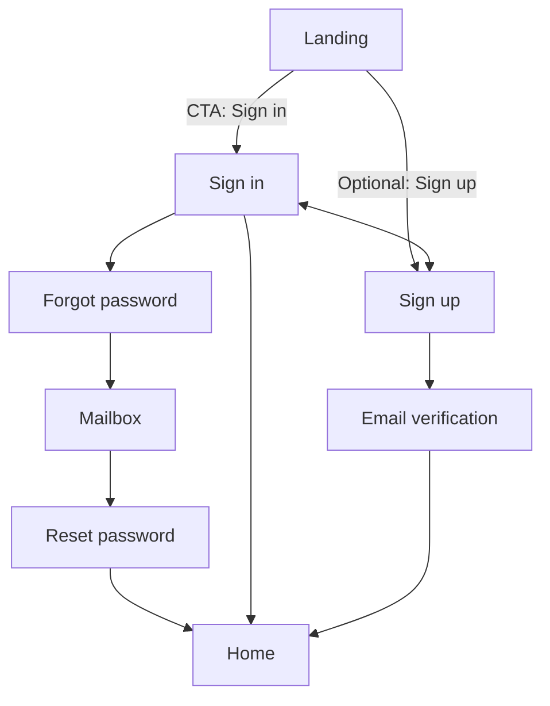
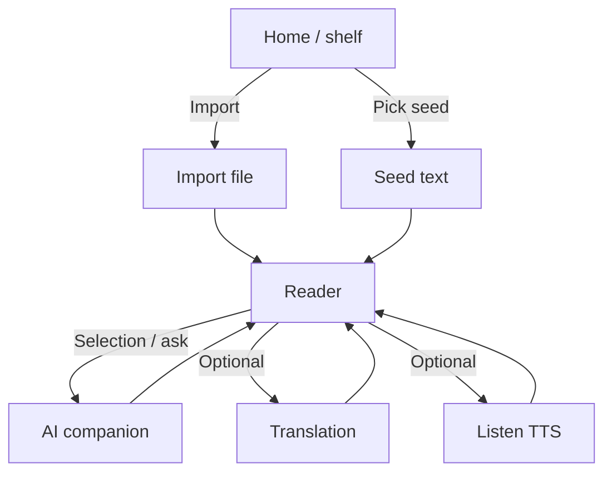
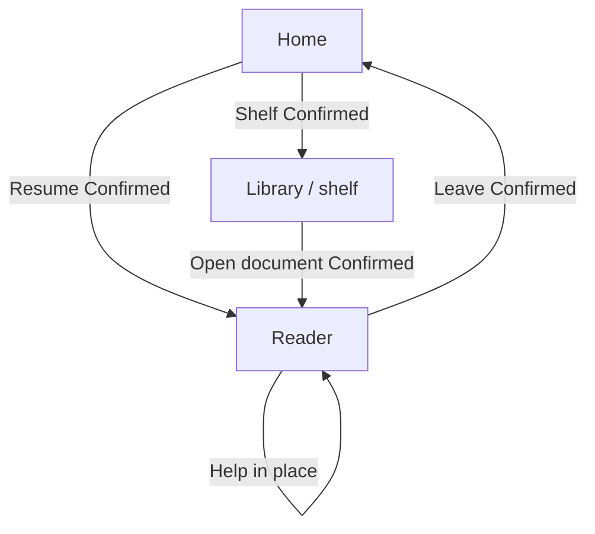

# Prototype & product flows

**SSOT for “which screen leads where.”**  
HTML under [`../../prd/`](../../prd/) is visual reference for **auth and reading chrome** only. Practice / Review / Progress HTML is **stale** (old learning-space loop). **This doc wins** when they disagree.

Related: [`mvp-scope.md`](./mvp-scope.md) · [`product-vision.md`](./product-vision.md) · [`feature-audit.md`](./feature-audit.md)

**How to use**

- Wire the app against the tables below.
- **Confirmed** = product decisions (auth 2026-08-05; reading loop 2026-08-20).
- Stale `prd/` links that open Practice or Review must not be treated as requirements.

---

## 1. Prototype inventory

| Surface                       | File                        | Audience   | Role now                                                 |
| ----------------------------- | --------------------------- | ---------- | -------------------------------------------------------- |
| Landing                       | `gloaming-landing-v1.html`  | Logged-out | Story / CTA into auth — **copy is stale**; follow vision |
| Sign in / up / forgot / reset | `gloaming-auth-*.html`      | Logged-out | Auth — still valid as flow                               |
| Dashboard                     | `dashboard.html`            | Logged-in  | Should become **reading home** (resume), not study hub   |
| Library                       | `gloaming-library-v1.html`  | Logged-in  | Should become **shelf** (my books + seed)                |
| Learning Room                 | `learning-room-v1.html`     | Logged-in  | **Reader** — still the core surface                      |
| Practice                      | `gloaming-practice-v1.html` | —          | **Do not implement further**                             |
| Review                        | `gloaming-review-v2.html`   | —          | **Do not implement further**                             |
| Progress                      | `gloaming-progress-v1.html` | —          | **Not in V1 shell**                                      |

---

## 2. Auth & marketing flow

Unchanged in structure. Landing primary CTA → Sign in. Sign-up → verify email → auto sign-in → **home**. Reset password → auto sign-in → **home**.



| From                   | To                          | Status                                  |
| ---------------------- | --------------------------- | --------------------------------------- |
| Landing primary CTA    | Sign in                     | **Confirmed**                           |
| Sign in success        | Home (reading)              | **Confirmed** (was Dashboard)           |
| Sign-up                | Check email → verify → Home | **Confirmed** (hard email verification) |
| Reset password success | Home                        | **Confirmed**                           |

---

## 3. First-time user journey (V1)

```text
Sign in
  → Home / shelf
  → Upload a file or choose seed
  → Reader opens
  → Read
  → Language barrier → contextual help / translation / TTS
  → Keep reading
```



**Confirmed (2026-08-20):** first success is **read a real page with help available**, not finish a practice set. Daily first action is **resume the unfinished text**.

Import UI may be a later slice than the reader; until it exists, seed pick is the stand-in—but V1 is not done without import ([`mvp-scope.md`](./mvp-scope.md)).

---

## 4. Daily reading loop (V1)

```text
Open Gloaming
  → Resume last document
  → Read
  → AI help when stuck
  → Keep reading
  → Leave (closing the book completes the session)
```



| From    | Entry                             | To                 | Status                       |
| ------- | --------------------------------- | ------------------ | ---------------------------- |
| Home    | Continue / last position          | Reader             | **Confirmed**                |
| Home    | Shelf                             | Library            | **Confirmed**                |
| Library | Open item                         | Reader             | **Confirmed**                |
| Reader  | Lookup / translate / TTS / assist | Stay in reader     | **Confirmed**                |
| Reader  | Done for now                      | Home or just close | **Confirmed**                |
| Reader  | Practice CTA                      | —                  | **Retired**                  |
| Home    | 复习 / 成长                       | —                  | **Retired from default nav** |

**Shell (Confirmed 2026-08-20):** default nav is **home + shelf** (labels may stay Chinese). No top-level Practice, Review, or Progress. Reader is reached via content.

**Home primary CTA (Confirmed):** always opens the **current document** in the reader. Shelf is for choosing something else or importing.

---

## 5. Happy path (V1 session)

```text
Sign in → Home
  → resume or import/pick
  → Reader (read + optional listen + on-demand help)
  → leave
```

Auth without this loop is **infra**, not product V1.

---

## 6. Cross-cutting rules

| Rule                                                   | Source                         |
| ------------------------------------------------------ | ------------------------------ |
| After auth, land on reading home                       | V1 scope                       |
| AI / lookup secondary inside the reader; not chat-home | vision + principles            |
| No required practice or review                         | V1 non-goals                   |
| Progress / streaks must not own the shell              | guardrails                     |
| This doc > ad-hoc HTML links                           | this SSOT                      |
| `prd/` Practice/Review/Progress                        | ignore as product requirements |

---

## 7. Confirmed decisions

| #   | Decision                                  | When                                |
| --- | ----------------------------------------- | ----------------------------------- |
| 1   | Landing primary CTA → Sign in             | 2026-08-05                          |
| 2   | Sign-up → verify → Home                   | 2026-08-05                          |
| 3   | Home continue → Reader (current document) | 2026-08-20 (replaces “今日 → 练习”) |
| 4   | Default nav → home + shelf only           | 2026-08-20                          |
| 5   | Practice / Review not in the loop         | 2026-08-20                          |
| 6   | Import + parse are V1, not a later bonus  | 2026-08-20                          |

Retired (2026-08-05, no longer Confirmed): Practice mainly from Room; nav 今日 / 图书馆 / 复习 / 成长; after Practice → Dashboard.

---

## 8. Known drift

| Where           | Issue                                 | Action                                                |
| --------------- | ------------------------------------- | ----------------------------------------------------- |
| Shipped app nav | 今日 / 图书馆 / 复习 / 成长           | Hide Review/Progress when implementing shell refactor |
| Dashboard       | 继续练习                              | Remove when touching home                             |
| Learn room      | 练几道小题                            | Remove when touching reader chrome                    |
| Landing copy    | Learning-space + practice/review loop | Update when touching landing                          |
| `prd/` HTML     | Old five-space product                | Do not build from it                                  |

**North star:** weekly minutes of engaged reading of authentic English—not practice completion, not review queues, not chat turns.

---

## 9. Change log

| Date       | Change                                                                                                        |
| ---------- | ------------------------------------------------------------------------------------------------------------- |
| 2026-08-20 | Replace study loop with first-time import + daily resume; retire Practice/Review/Progress from confirmed nav. |
| 2026-08-05 | Initial SSOT from docs + `prd` auth wiring (superseded loop).                                                 |
