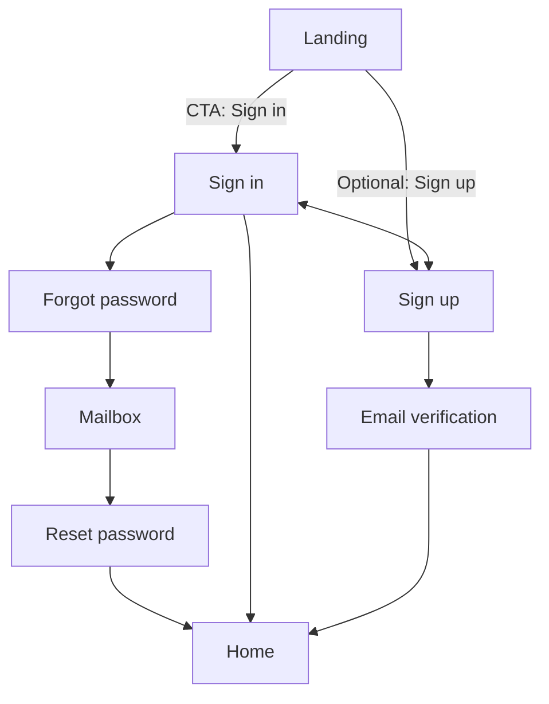
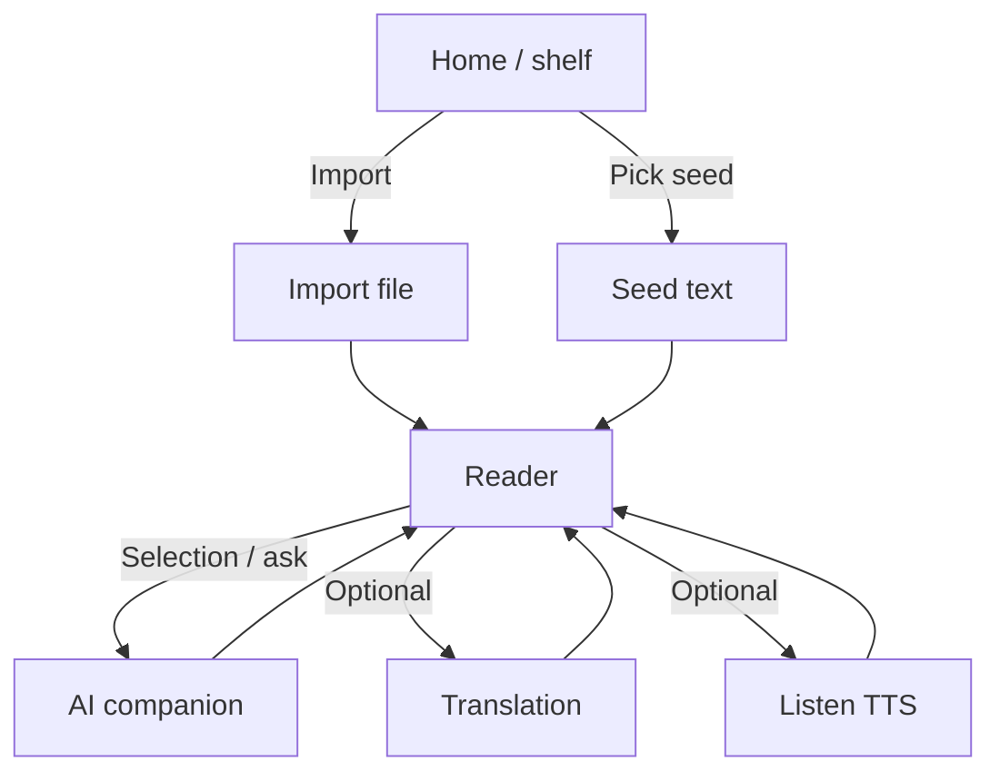
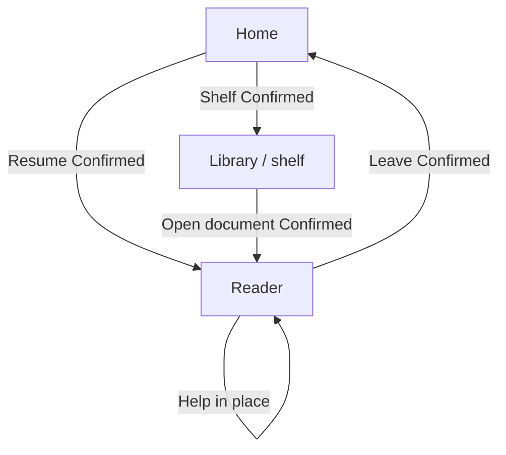

# Product flows

**SSOT for “which screen leads where.”** Wire the shipped app against the tables below. Visual tokens: [`DESIGN.md`](../../DESIGN.md).

Related: [`mvp-scope.md`](./mvp-scope.md) · [`product-vision.md`](./product-vision.md) · [`feature-audit.md`](./feature-audit.md)

**How to use**

- Wire the app against the tables below.
- **Confirmed** = product decisions (auth 2026-08-05; reading loop 2026-08-20).
- Do not revive Practice or Review screens.

---

## 1. Surfaces (V1)

| Surface         | Audience   | Role now                                        |
| --------------- | ---------- | ----------------------------------------------- |
| Landing         | Logged-out | Story / CTA into auth                           |
| Sign in / up    | Logged-out | Auth                                            |
| Home            | Logged-in  | Reading home: resume unfinished text            |
| Library / shelf | Logged-in  | Choose or import content                        |
| Reader          | Logged-in  | Core surface: read + assist / translate / TTS   |
| Progress / 成长 | Logged-in  | Reading-history overview (kept; optimize later) |

Practice and Review surfaces are **removed** from the product and codebase.

---

## 2. Auth & marketing flow

Unchanged in structure. Landing primary CTA → Sign in. Sign-up → verify email → auto sign-in → **home**. Reset password → auto sign-in → **home**.



| From                   | To                          | Status                                  |
| ---------------------- | --------------------------- | --------------------------------------- |
| Landing primary CTA    | Sign in                     | **Confirmed**                           |
| Sign in success        | Home (reading)              | **Confirmed** (was Dashboard)           |
| Sign-up                | Check email → verify → Home | **Confirmed** (hard email verification) |
| Reset password success | Home                        | **Confirmed**                           |

---

## 3. First-time user journey (V1)

```text
Sign in
  → Home / shelf
  → Upload a file or choose seed
  → Reader opens
  → Read
  → Language barrier → contextual help / translation / TTS
  → Keep reading
```



**Confirmed (2026-08-20):** first success is **read a real page with help available**, not finish a practice set. Daily first action is **resume the unfinished text**.

Import UI may be a later slice than the reader; until it exists, seed pick is the stand-in—but V1 is not done without import ([`mvp-scope.md`](./mvp-scope.md)).

---

## 4. Daily reading loop (V1)

```text
Open Gloaming
  → Resume last document
  → Read
  → AI help when stuck
  → Keep reading
  → Leave (closing the book completes the session)
```



| From    | Entry                             | To                 | Status                |
| ------- | --------------------------------- | ------------------ | --------------------- |
| Home    | Continue / last position          | Reader             | **Confirmed**         |
| Home    | Shelf                             | Library            | **Confirmed**         |
| Library | Open item                         | Reader             | **Confirmed**         |
| Reader  | Lookup / translate / TTS / assist | Stay in reader     | **Confirmed**         |
| Reader  | Done for now                      | Home or just close | **Confirmed**         |
| Reader  | Practice CTA                      | —                  | **Retired** (removed) |
| Home    | 复习                              | —                  | **Retired** (removed) |

**Shell (Confirmed 2026-08-20, updated same day):** default nav is **home + shelf + 成长** (reading-history overview). No Practice or Review. Reader is reached via content.

**Home primary CTA (Confirmed):** always opens the **current document** in the reader. Shelf is for choosing something else or importing.

---

## 5. Happy path (V1 session)

```text
Sign in → Home
  → resume or import/pick
  → Reader (read + optional listen + on-demand help)
  → leave
```

Auth without this loop is **infra**, not product V1.

---

## 6. Cross-cutting rules

| Rule                                                   | Source                     |
| ------------------------------------------------------ | -------------------------- |
| After auth, land on reading home                       | V1 scope                   |
| AI / lookup secondary inside the reader; not chat-home | vision + principles        |
| No required practice or review                         | V1 non-goals               |
| Progress is reading history, not streak theater        | guardrails + feature-audit |
| This doc is navigation SSOT                            | this file                  |

---

## 7. Confirmed decisions

| #   | Decision                                  | When                                |
| --- | ----------------------------------------- | ----------------------------------- |
| 1   | Landing primary CTA → Sign in             | 2026-08-05                          |
| 2   | Sign-up → verify → Home                   | 2026-08-05                          |
| 3   | Home continue → Reader (current document) | 2026-08-20 (replaces “今日 → 练习”) |
| 4   | Default nav → home + shelf + 成长         | 2026-08-20                          |
| 5   | Practice / Review not in the loop         | 2026-08-20                          |
| 6   | Import + parse are V1, not a later bonus  | 2026-08-20                          |

Retired (2026-08-05, no longer Confirmed): Practice mainly from Room; nav 今日 / 图书馆 / 复习 / 成长; after Practice → Dashboard.

---

## 8. Known drift

| Where            | Issue                                       | Action                                          |
| ---------------- | ------------------------------------------- | ----------------------------------------------- |
| App nav          | Still labeled 今日 / 图书馆 / 成长          | Keep 成长 as reading history; copy may evolve   |
| Library          | Published catalog, not “my shelf”           | Import + user shelf (V1)                        |
| Content atom     | Short curated `article.body`                | Document / chapters (see feature-audit §4.1)    |
| Progress metrics | “Learning days” wording; no year/30d volume | Evolve toward reading-volume summary when ready |

**North star:** weekly minutes of engaged reading of authentic English—not practice completion, not review queues, not chat turns.

---

## 9. Change log

| Date       | Change                                                                                               |
| ---------- | ---------------------------------------------------------------------------------------------------- |
| 2026-08-20 | Removed `prd/` HTML prototypes; Practice/Review gone from code; Progress kept as reading history.    |
| 2026-08-20 | Replace study loop with first-time import + daily resume; retire Practice/Review from confirmed nav. |
| 2026-08-05 | Initial SSOT from docs + `prd` auth wiring (superseded loop).                                        |
